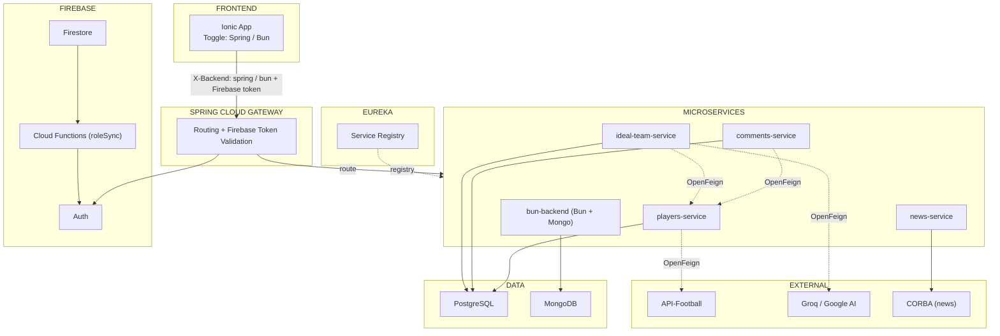

# My Soccer Project

A full-stack football players management application built as a microservices monorepo. It features user registration, player CRUD with external import (API-Football), comments with ratings, AI-generated "Ideal Team" lineups, a CORBA-backed news feed, and a unique **dual-backend toggle** that lets the Ionic frontend switch between the Spring Boot stack and the Bun/Node stack at runtime.

> Detailed spec (in Spanish) lives at [`docs/specification.md`](docs/specification.md).

---

## Features

- **Authentication & roles** — Firebase Auth (email/password + anonymous), with role sync via Firestore Cloud Functions.
- **Players** — CRUD, search, filter (name, team/league, registration date), geolocation, and import from [API-Football](https://www.api-football.com/).
- **Comments** — per-player comments with author, text (max 1000 chars), 0-5 star rating, geolocation.
- **Ideal Team** — AI-generated optimal lineups via Groq / Google AI Studio.
- **News** — CORBA producer/consumer pattern, separate from the REST stack.
- **Dual backend** — frontend toggle routes traffic to either Spring Boot services or the Bun/Elysia services, sharing the same API contract.
- **Admin role** — manage players, comments, and news.
- **Mobile** — Capacitor-powered Ionic app (Android-ready; geolocation, camera, haptics).

---

## Tech Stack

| Layer | Stack |
| --- | --- |
| Frontend | Ionic 8 + Angular 20 (standalone components), Capacitor 8, Leaflet |
| Backend A (Spring) | Spring Boot 4, Java 17, Spring Cloud Netflix Eureka, Spring Cloud Config, OpenFeign, JPA |
| Backend B (Bun) | Elysia + Bun + TypeScript, Mongoose, Zod, AI SDK (Groq) |
| News | Spring Boot, **Java 8**, CORBA |
| Databases | PostgreSQL 18, MongoDB 4.4 |
| Service mesh | Spring Cloud Gateway, Eureka, Spring Cloud Config Server (Git-backed) |
| Auth & serverless | Firebase Auth, Firestore, Cloud Functions, Firebase Storage |
| Infra / IaC | Terraform Cloud (Azure Container Apps + GCP Artifact Registry) |
| CI/CD | GitHub Actions |
| E2E tests | Playwright (Firefox + Mobile Chrome) |
| Linting | Biome (bun-backend), ESLint (ionic-app), Checkstyle + SpotBugs (Java) |

---

## Architecture

```
config-server (:8888) → eureka-server (:8761) → gateway (:8080) → [players, comments, ideal-team, news]
bun-backend → eureka + config-server + MongoDB
ionic-app → Firebase (Auth + Firestore + Functions) + gateway
```



### Gateway routes

All routes are auto-discovered through Eureka and exposed by the gateway. The gateway also injects JWT-derived headers (`X-User-Id`, `X-User-Role`, `X-User-Email`, `X-User-Token`) into proxied requests.

| Service | URL |
| --- | --- |
| Players | `http://localhost:8080/players-service/**` |
| Comments | `http://localhost:8080/comments-service/**` |
| Ideal Team | `http://localhost:8080/ideal-team-service/**` |
| News | `http://localhost:8080/news-service/**` |
| Bun Backend | `http://localhost:8080/bun-backend/**` |
| Gateway health | `http://localhost:8080/actuator/health` |
| Eureka dashboard | `http://localhost:8761` |
| Config Server | `http://localhost:8888` |

---

## Quick Start (Docker Compose)

### Prerequisites

- **Docker** 24+ and **Docker Compose** v2
- **Bun** 1.3.14+ (for the JS workspaces + Firebase emulator)
- ~10 GB RAM free (8 GB for the stack, headroom for the Firebase emulator)
- Java 17, Java 8, and Maven wrapper (`./mvnw`) — only needed if you plan to develop individual services locally without the full stack

### 1. Clone & configure

```bash
git clone https://github.com/aek676/my-soccer-project
cd my-soccer-project

cp .env.example .env
# Edit .env and set API_KEY_API_FOOTBALL=<your-key> (optional — only needed for player import)

# Install all JS workspace dependencies from the repo root
# (ionic-app, testE2E, bun-backend) + firebase-tools for the emulator
bun ci
```

### 2. Build the Java service images

The Java services use Spring Boot buildpacks, which require building the images before `docker compose up`.

```bash
./build-images.sh
```

This builds `config-server`, `eureka-server`, `gateway`, `players-service`, `comments-service`, and `ideal-team-service` in parallel. The `news-service` and `bun-backend` images are built on-demand by Compose (they have their own Dockerfiles).

### 3. Boot the stack

```bash
docker compose up -d
```

### 4. Start the Firebase emulators + Ionic frontend (two extra terminals, from the repo root)

```bash
# Terminal A — Firebase emulators (Auth on 9099, Firestore on 8088, Functions on 5001, Storage on 9199, Hosting on 5000, UI on 4000)
bun run emulator

# Terminal B — Ionic app, using the `emulator` Angular configuration (points the app at the local emulators)
bun run start:front
```

### 5. Open the dashboards

| URL | What |
| --- | --- |
| <http://localhost:8080/actuator/health> | Gateway health check |
| <http://localhost:8761> | Eureka service registry |
| <http://localhost:4000> | Firebase Emulator Suite UI (runs on the host) |
| <http://localhost:4200> | Ionic dev server (after `bun run start:front`) |

Startup is enforced by `depends_on`: `config-server` → `eureka-server` → `gateway` → other services. Allow **~60 seconds** after `up` for all services to register with Eureka and become healthy.

### 6. Stop / reset

```bash
docker compose down           # stop containers, keep volumes
docker compose down -v        # stop containers AND wipe volumes (postgres, mongo)
```

---

## CI/CD

GitHub Actions in `.github/workflows/`. The `main.yml` workflow uses `dorny/paths-filter` to run only the affected service workflows on PR/push to `main`.

| Workflow | What it does |
| --- | --- |
| `tmpl-java-maven-build-push-deploy.yml` | Template: `./mvnw verify` → buildpack image → push to GCP Artifact Registry → deploy to Azure Container Apps |
| `news-service.yml` | Java 8 service: `./mvnw test` → Dockerfile build → push → deploy |
| `bun-backend.yml` | `bun ci` → typecheck → biome → build → `bun test` (testcontainers) → Docker build → deploy |
| `ionic-app.yml` | `bun ci` → ESLint (reviewdog) → Karma headless tests → prod build → Firebase deploy (preview on PR, live on push) |
| `playwright.yml` | PR-only, after ionic-app: fetches Firebase preview URL as `BASE_URL` |
| `terraform-plan.yml` / `terraform-apply.yml` | Plan on PR, apply on push to `main` (paths: `terraform/**`) |

Images are tagged `latest` and `${{ github.sha }}`. Azure resource group: `rg-my-soccer-project-eureka`.

---

## Sources / Credits

### Project repositories (course work)

- [Project config (Spring Cloud Config)](https://github.com/aek676/spring-my-soccer-project-microservices-config)
- [CNSA](https://github.com/aek676/cnsa-2026)
- [TRWM](https://github.com/aek676/trwm-2026)
- [DWSC](https://github.com/aek676/dwsc-2026)
- [DAH](https://github.com/aek676/dah-2026)

### External references

- [Launch a Java Microservice on Azure Container Apps](https://learn.microsoft.com/en-us/azure/container-apps/java-microservice-get-started?tabs=azure-cli)
- [Angular Design Patterns: Factory Pattern](https://vugar-005.medium.com/angular-design-patterns-factory-pattern-f72fcbfb60b8)
- [Angular Design Patterns: Strategy Pattern](https://vugar-005.medium.com/angular-design-patterns-strategy-pattern-ace359ae77b3)
- [Toggle Backend with Factory/Strategy Pattern](https://github.com/aek676/toogle-backend-factory-strategy.git)

Full project specification (use cases, ER diagram, architecture) is in [`docs/specification.md`](docs/specification.md).
