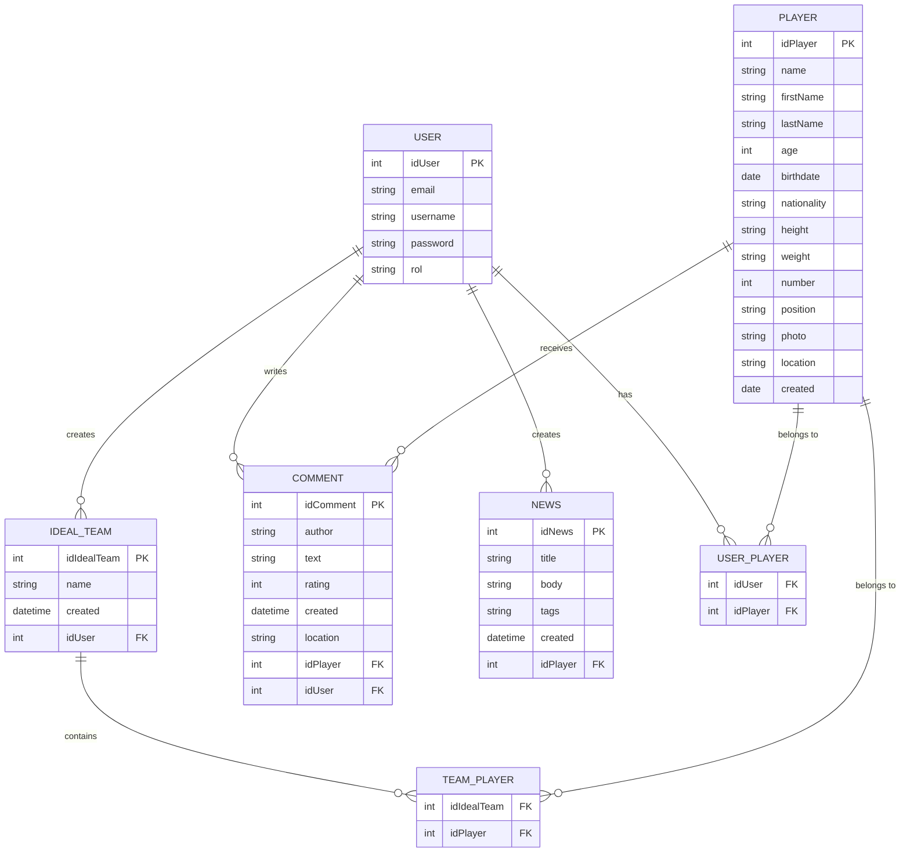

# Especificación del proyecto

El objetivo de este proyecto es desarrollar una aplicación
para la gestión de jugadores y estadísticas de fútbol.

Los usuarios no registrados pueden registrarse en la aplicación,
acceder a un listado completo de jugadores y buscar jugadores.
Dicha búsqueda se debe realizar a partir de una base de datos local. Los criterios de búsqueda permitirán filtrar por nombre del jugador, equipo/liga y fecha de alta en el sistema.

Al acceder a un jugador, se mostrarán sus datos y una imagen identificativa. Se pueden añadir comentarios sobre
cada jugador, con los campos: autor, comentario (máx. 1000 caracteres) y valoración (0 a 5 estrellas).

Los usuarios registrados, previo inicio de sesión, pueden:

- Insertar nuevos jugadores desde API externa: Buscando en una API externa de fútbol (p.e. [API Football](https://www.api-football.com/)) para seleccionar e importar datos. A partir de los resultados de la búsqueda, los usuarios podrán seleccionar uno o varios jugadores para realizar su inserción en la base de datos local.

- Insertar nuevo jugador desde formulario: Añadiendo la imagen del jugador mediante URL o el acceso a
  la cámara del dispositivo.

- Solicitar la generación de un “Equipo Ideal” basado en los jugadores insertados mediante el uso de LLMs con Groq o Google AI Studio (enlace).

- Visualizar noticias de jugadores: Haciendo uso de un consumidor de noticias en CORBA

Existirá también un usuario administrador que podrá:

- Dar de alta nuevas noticias de jugadores: Haciendo uso de un productor de noticias en CORBA.

- Editar y eliminar jugadores, así como borrar comentarios.

Siempre que se lleve a cabo una operación de inserción, tanto de jugadores como de comentarios, se
almacenará la geolocalización del cliente desde el cual se está realizando dicha operación. Esta geolocalización será editable en el caso de insertar nuevo jugador desde formulario para situar el jugador en un mapa.

Todas las funcionalidades (excepto las relacionadas con CORBA) deben poder resolverse desde dos backends: uno implementado con el stack tecnológico de la asignatura TRWM y otro con el de la asignatura DWSC. En el front-end debe existir un componente tipo toggle para poder conmutar el destino de las peticiones

La navegación en la aplicación debe permitir flexibilidad en el acceso a la funcionalidad. La aplicación debe tener un estilo personalizado en todos los componentes y páginas. Además, debe incluir un icono y una pantalla de carga asociados al estilo de la aplicación.

Se deben implementar pruebas unitarias para los componentes y los servicios desarrollados. Adicionalmente, se deben implementar las siguientes pruebas e2e: inicio de sesión, registro, inserción de un nuevo elemento a partir del formulario, y búsqueda de elementos.

# Diagrama de casos de uso

> [!NOTE]
> Para editar el DCU, pulsa [aquí](https://www.plantuml.com/plantuml/uml/bPJ1RjGm48RlUOfHBxI7zW5GLNNPLb09SLYqNAEfCmr3dV5YEmWGhyG1yGXzCUnfccJZHOMJdM_-6OzdFBaC4NtiErjPkeiG7NXkFqPes9E9xAGAzomxzDZ13iqzjlG-VhC4sOpIMggg5t15Toni-E6tG4EmCj5v2XNc5OwswoF00Dlr2DvjbAHrH0EPmEfAILhp2M_8anZ6UVZj6iv_d9vgc76VjXlTgcTsNMDm8VlrmUKbvT47CXW8ZZwG1yiXOkFWKz-c9GNMSx-GhmVB97_L1uD-eRnLM8zmag-nk-Malqs58sbKRHvPFR1vAcFWCO7XUnAj7dvXmnwCwqWYUdQgHScqdkY1UskPna0RQZb4ZpwGHl3JzoIw4JOv_q0XjrQ5_CZgp9mSF6Tsp6iIIa7X-dFFEmSt3Q7LCEsZeIOrb1SSRWxqbKCaYJI_vmZ_xYVkiAkumdkelRYORwOtAP_2a_NWXLTNKwXhonqBxlUI1bWszBhXk1GhAgLhJpYcgKgJo9XQaPbntGvzvCQ5MPriXuPoVYqvwmnQ_evcx2u-cUjapX4tP9FP2GNOUHR3ExHfV_psuQTGJi59PEandEGHJ5CtdnibvNmeBWQXIkypyVbB753nvhPA5qz8OV52zh6ufMNHtDJA18j-ZRpXMD2Y3VEYDGGinlOwG71yVgvV3LrSd5IpKi7PsSLyuk4bpAJLieJFo6SMLHQ_XuM-AWNgDdyC2vTbdV_LGTn_-EoN-rbvTKdIz9tz0m00)

# Diagrama Entidad-Relación

