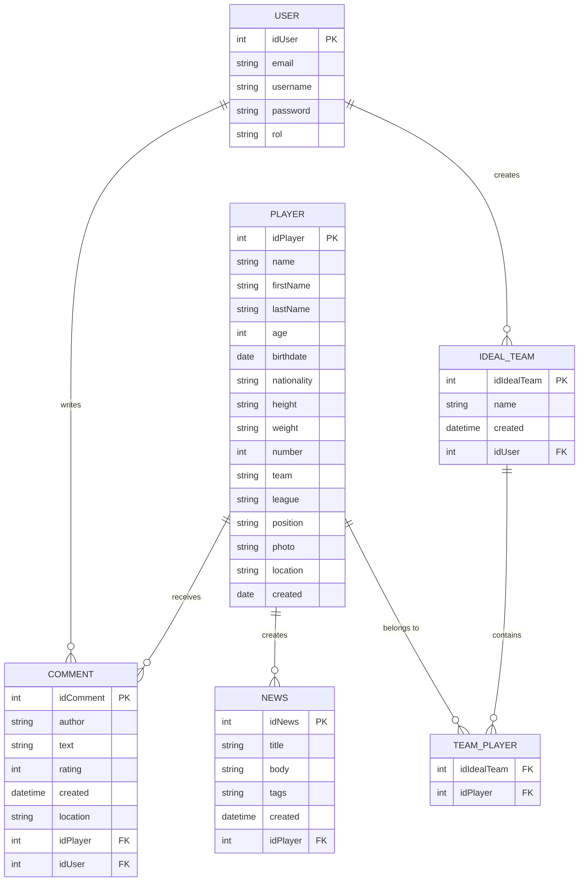
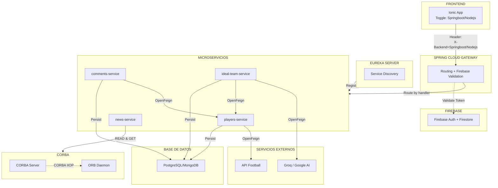

# 1. Especificación del proyecto

El objetivo de este proyecto es desarrollar una aplicación
para la gestión de jugadores y estadísticas de fútbol.

Los usuarios no registrados pueden registrarse en la aplicación,
acceder a un listado completo de jugadores y buscar jugadores.
Dicha búsqueda se debe realizar a partir de una base de datos
local. Los criterios de búsqueda permitirán filtrar por nombre
del jugador, equipo/liga y fecha de alta en el sistema.

Al acceder a un jugador, se mostrarán sus datos y una imagen
identificativa. Se pueden añadir comentarios sobre
cada jugador, con los campos: autor, comentario (máx. 1000
caracteres) y valoración (0 a 5 estrellas).

Los usuarios registrados, previo inicio de sesión, pueden:

- Insertar nuevos jugadores desde API externa: Buscando en
  una API externa de fútbol (p.e. [API Football](https://www.api-football.com/))
  para seleccionar e importar datos. A partir de los resultados
  de la búsqueda, los usuarios podrán seleccionar uno o varios
  jugadores para realizar su inserción en la base de datos local.

- Insertar nuevo jugador desde formulario: Añadiendo la imagen del
  jugador mediante URL o el acceso a la cámara del dispositivo.

- Solicitar la generación de un “Equipo Ideal” basado en los jugadores
  insertados mediante el uso de LLMs con Groq o Google AI Studio (enlace).

- Visualizar noticias de jugadores: Haciendo uso de un consumidor de noticias
  en CORBA

Existirá también un usuario administrador que podrá:

- Dar de alta nuevas noticias de jugadores: Haciendo uso de
  un productor de noticias en CORBA.

- Editar y eliminar jugadores, así como borrar comentarios.

Siempre que se lleve a cabo una operación de inserción, tanto
de jugadores como de comentarios, se almacenará la geolocalización
del cliente desde el cual se está realizando dicha operación. Esta
geolocalización será editable en el caso de insertar nuevo jugador
desde formulario para situar el jugador en un mapa.

Todas las funcionalidades (excepto las relacionadas con CORBA) deben
poder resolverse desde dos backends: uno implementado con el stack tecnológico
de la asignatura TRWM y otro con el de la asignatura DWSC. En el frontend debe
existir un componente tipo toggle para poder conmutar el destino de las peticiones

La navegación en la aplicación debe permitir flexibilidad en el acceso a la funcionalidad
. La aplicación debe tener un estilo personalizado en todos los componentes y páginas.
Además, debe incluir un icono y una pantalla de carga asociados al estilo de la
aplicación.

Se deben implementar pruebas unitarias para los componentes y los servicios desarrollados.
Adicionalmente, se deben implementar las siguientes pruebas e2e: inicio de sesión,
registro, inserción de un nuevo elemento a partir del formulario, y búsqueda de
elementos.

# 2. Diagrama de casos de uso

> [!NOTE]
> Para editar el DCU, pulsa [aquí](https://www.plantuml.com/plantuml/png/dLJDRjGm4BxdAKQzq1vQxgYgkgGLLAeGMhHSewap3QREEDWE0iJBy00S48-mBuRjtJhUEAY2KvnlllcPyUUvj0wD6tjLARftu3GOsNrmq4f3madDbNsGFA317WOK3zZHE_TL4GGpSgUegfx15TrBba9kVpEq12lXj25ROVZ2qQO-0hImgHFmPXqH_qtG7fc0rLL4_3TaU4s6M4ZCmszgEFz-UXh3fBC_hkCnUWRN6gssmM-qsdz27QCbWPRWw3qPKD8wR3Ly73jiG-2OzpEPPc-Pw2z7Az3Cc7SHR18uqMlixwJdt_d14RUHBNPOiyVoKbBWLC3-VoAjjh-mbGQ4xeaT6gaZ5pcWpOGkzkt7b0AjgVFD6JIMOWGp_K-act2dQC2I3LSRYNA7DG7Jl9WdI_EAc0mQkFuqoa73JKkeOfXkPsWe6kODfaa0VV5b4JlA-qpWt_rOBxkoddcdsRDseRFOIIc5HskXXTNR6v_9aM7CrO23p8gBkK7swDlsyxbzNcz_z6WmhsndRKQZ5eVgnPpYNIlPIyP3lT0UB4LptKet9tkefAR8XS1Iy0cVnIzT8hheK1l2DF185Xv9Goxwzp46D4wsscP3LJqA2hLsf9KMgEGt54cd-6Xkl3b4N9FoPiraOJ2IXHnG-VFnxVOdKoX1ivCyeZq9oyJlZtm3HAHywH4kddJbNvh7ypUrXuhNiudex354iDJw0Sowi1p8jFA2yM2XYeJ7sodGyffd3gMXkBfiq2s1PA76k3xW-Fmy_hLqSN5IPUE5ixEBVD_12yYerNpiJz1pYsUMot76hqf2TCi5D7EPtyt_EKohOfdD-fypb3x5Tfdv7GhXoJI539xqk2Hknrxz0G00)

# 3. Diagrama Entidad-Relación

# 4. Diagrama de Arquitectura

## 4.1 Explicación

La aplicación sigue una **arquitectura de microservicios** con los siguientes componentes:

| Capa               | Componentes                                                  |
| ------------------ | ------------------------------------------------------------ |
| **Frontend**       | Ionic App con toggle para elegir entre SpringBoot o Node.js  |
| **Gateway**        | Spring Cloud Gateway (enrutamiento + Firebase Admin SDK)     |
| **Descubrimiento** | Eureka Server (registro de servicios)                        |
| **Microservicios** | players, comments, ideal-team, news                          |
| **Datos**          | PostgreSQL o MongoDB + Firestore                             |
| **Firebase**       | Firebase Auth + Firestore (autenticación y datos de usuario) |
| **CORBA**          | Servidor para noticias (productor/consumidor)                |
| **Externos**       | API Football + Groq/Google AI (LLM)                          |

### Flujo principal

1. El frontend envía peticiones con header `X-Backend` indicando el backend destino y el token de Firebase
2. El Gateway valida el token con Firebase Admin SDK y enruta según el header
3. Eureka registra los microservicios disponibles
4. Los servicios se comunican entre sí via OpenFeign
5. CORBA se usa exclusivamente para noticias

### Dual Backend

La característica distintiva es el **toggle** que permite conmutar entre el
stack TRWM (Node.js) y DWSC (SpringBoot), manteniendo la misma interfaz frontend.
